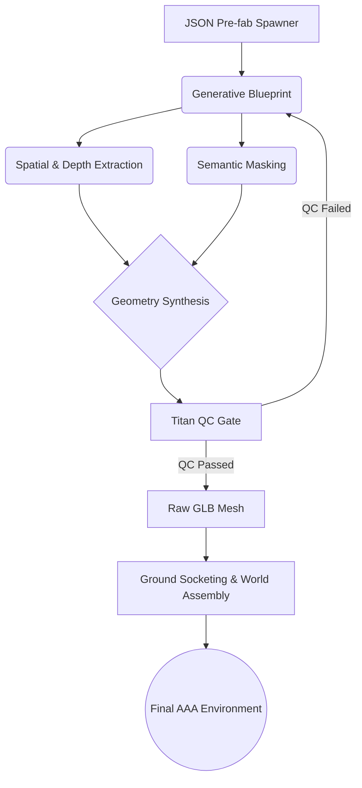

# 🌍 AI WORLD ENGINE (AWE)
**Next-Generation Procedural 3D World Generation Framework**

---

## 🚀 Vision
The **AI World Engine (AWE)** is an enterprise-grade pipeline designed to bridge the gap between generative AI and production-ready 3D game environments. By orchestrating a symphony of state-of-the-art vision models, AWE translates natural language directly into high-fidelity, physics-ready geometric environments. 

We are not just generating meshes; we are synthesizing **coherent, usable worlds**.

## 🧠 Core Architecture
AWE operates on a multi-stage, modular pipeline designed for extreme scalability and hardware-accelerated processing, optimized for NVIDIA data-center architectures (A100 / L40S / H100).

### 1. Conceptual Blueprinting
Leveraging highly-tuned diffusion models, AWE synthesizes the base structural blueprint of the environment. This phase ensures AAA-level conceptual design, strict adherence to architectural logic, and hyper-realistic material definitions before any 3D processing begins.

### 2. Spatial Intelligence Layer
Before a single polygon is generated, AWE understands the scene spatially:
- **Depth Analysis:** Extracts precise spatial relationships and geometric scaling.
- **Semantic Segmentation:** Isolates structures, props, and terrain. This ensures buildings are processed as distinct architectural entities and allows for precise material mapping.

### 3. High-Fidelity Geometry Synthesis
Moving beyond simple point clouds or Gaussian Splats, AWE utilizes advanced Sparse Voxel structures to generate **real, production-ready GLB meshes**. 
- Advanced non-manifold geometry resolution.
- High-fidelity surface extraction designed for game engines (Unreal Engine 5, Godot).

### 4. World Assembly & Ground Socketing
*The crowning achievement of AWE.* Generating a 3D asset is solved; integrating it seamlessly into a procedural world is the real challenge. AWE employs advanced procedural logic to:
- **Ground Socketing:** Automatically blend generated structures into procedural terrains without floating vertices, clipping, or manual environment art adjustments.
- **Procedural Symmetry & Pre-Fab Spawners:** Optimize geometry generation to create vast, coherent cityscapes in seconds using JSON-driven orchestrators.

## ⚙️ Technical Specifications
- **Core Framework:** PyTorch 2.0+, CUDA 12.x, Triton
- **Compute Requirements:** Enterprise GPU recommended for optimal throughput (40GB+ VRAM). Includes robust VRAM management for consumer hardware fallback.
- **Autonomous QA:** Features a heavily integrated "Titan QC" multi-gate evaluation system. The engine autonomously validates visual entropy, structural integrity, and depth fidelity, regenerating failures without human intervention.
- **Output:** Production-ready `.glb` / `.obj`

## 📊 Pipeline Flow


## 🔒 Security & Proprietary Systems
**Note:** *The exact algorithmic weighting, localized fine-tunes, proprietary Ground-Socketing math functions, and our internal Generative Prompts (the "Secret Sauce") are highly confidential and excluded from this repository.* 

AWE is designed to operate as a "black box" for end-users, requiring zero manual topological tweaking.

## 🏁 Getting Started

### Environment Validation
AWE requires a robust Linux/Windows environment with NVIDIA drivers configured.

```bash
# Clone the core engine
git clone <repository_url>
cd AI_World_Engine

# Run the modular diagnostics suite
# Validates CUDA, Network, and individual model shards
bash tests/run_all.sh
```

### Deployment
To initiate a world generation sequence using the master orchestrator:
```bash
python titan_master.py --config deploy_config.py
```

---
*Built for the future of interactive entertainment and spatial computing. Powered by state-of-the-art Generative AI. Designed to scale on NVIDIA infrastructure.*
